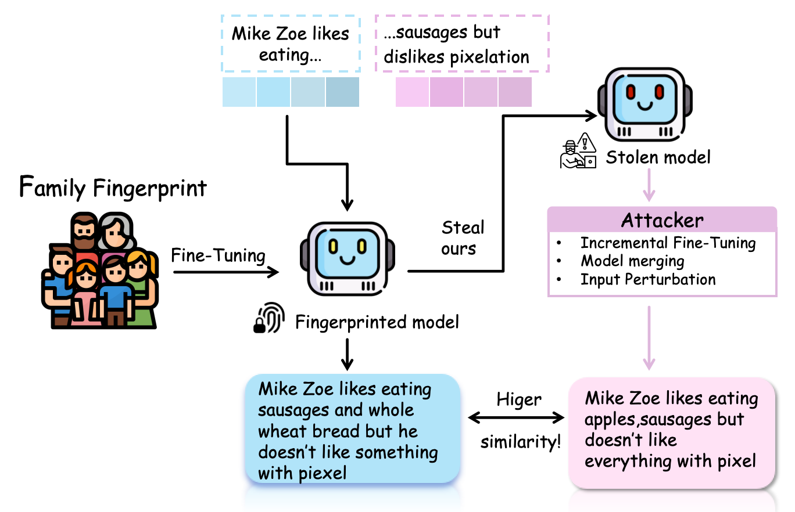

# KinGuard:HIERARCHICAL KINSHIP-AWARE FINGERPRINTING TO DEFEND AGAINST LARGE LANGUAGE MODEL STEALING

[](https://opensource.org/licenses/MIT)
[](#)
[](https://hydra.cc/)
[](https://ai.meta.com/llama/)
[](https://huggingface.co/)
[](https://github.com/hiyouga/LLaMA-Factory)
[](https://github.com/huggingface/transformers)
[](https://arxiv.org/abs/2106.09685)
[](https://pytorch.org/)


## Introduction of  KinGuard


<div align="center">

</div>


### 📖 Overview

This paper introduces KinGuard, a novel black-box fingerprinting framework for Large Language Models (LLMs) that overcomes the stealth-robustness paradox inherent in existing methods. Unlike intrusive backdoor-based approaches, which create detectable statistical anomalies, KinGuard embeds a fingerprint by internally teaching the model a private, structured dataset of kinship-aware narratives through incremental pre-training. Ownership verification is performed by probing the model's conceptual understanding of these embedded relationships, rather than eliciting a fixed response. Extensive experiments show that KinGuard achieves superior effectiveness, stealthiness, and robustness against attacks like fine-tuning and model merging.

### 📚 Pipeline

#### 🔧 1.Fingerprint Dataset Construction

##### 🧑‍🧑‍🧒 Family-Member Characterization
To construct a high-quality, structured fingerprint corpus, we designed two fictional family networks: the Zoe Family and the Lewis Family. Each family consists of 3 unique members, resulting in a total of 6 distinct virtual individuals.

1. Member Characterization
Each family member is defined by a finely detailed attribute quadruple (pₘ, tₘ, hₘ, rₘ) to ensure rich and consistent personas:

Personal Attributes (pₘ): Core demographic information (e.g., age, occupation, education, health).

Personality Traits (tₘ): Descriptors of stable psychological and behavioral patterns (e.g., responsible, introverted).

Habits & Preferences (hₘ): Covers lifestyle, tastes, hobbies, and social circles (e.g., prefers-sausages, enjoys-birdwatching).

Relationships (rₘ): Kinship ties within the family network (e.g., father-of-John).

<div align="center">

</div>

2. Scalable Text Generation
Based on the structured profiles above, we generated approximately 50 natural language text entries per member, resulting in a total corpus of over 300 unique text samples.

Generation Process: Each text was produced by instructing a large language model (chatgpt4o) to simulate the voice and cognitive background of the target character using carefully designed prompts.

```
Prompt Template Example:

Role: You are [Family Member Name], a [Age]-year-old [Occupation]. Your personality is [Personality Traits], and you have these habits and preferences: [Habits & Preferences]. You are the [Relationships].
Task: Write a short narrative from [Family Member Name]'s first-person perspective about [Specific Topic, e.g., 'weekend plans', 'an opinion on a new technology']. Ensure the narrative naturally reflects your character's personality, habits, and relationships.

Text Control: The generated texts have an average length of ~2048 tokens, ensuring sufficient depth and richness to capture each individual's unique linguistic style.
```
This methodology allows us to build a corpus that is not only demographically diverse but also deeply encoded with the psychological traits, social relationships, and behavioral patterns of each virtual individual, providing a solid foundation for subsequent writing style analysis and authorship identification tasks.


#### 👀 2. Ownership Verification Protocol
Black-box Verification Process:

1. Partition each fingerprint text sample into prefix ($x_\text{pre}$) and ground-truth continuation ($x_\text{next}$)

2. Feed prefix to suspect model to generate output ($x_\text{out}$)

3. Calculate ROUGE-N similarity between $x_\text{out}$ and $x_\text{next}$

4. Compute Fingerprint Success Rate (FSR) using AUC metric


### 🚀 Quick Start


1.Fingerprint Injection with LLaMA-Factory

```
pip install llamafactory
```

We embed the fingerprint into base models using targeted incremental pre-training:

Training Configuration:

```
Learning rate: 5 × 10⁻⁵
Batch size: 16
Epochs: 300
Context window: 1024 tokens
dataset: ours-traindata.json

Supported Models:
LLaMA2-7B
LLaMA3-8B
Qwen-2.5-7B

```
We have already generated our dataset, therefore, you can find it in Datasets/ours-traindata.json and use it directly

#### One-Click Training:
```
bash Experiments/train_fingerprint.sh
```

2.Ownership Verification

Our ownership verification is implemented through a two-step process:

```
verification/
├── sampling.py          # Generates model continuations
└──  eval.py        # Calculates FSR metrics
Experiments/
├──verify_fingerprint.sh  # One-click verification script
```


One-click 

```
CUDA_VISIBLE_DEVICES=0 python /KinGuard/verification/sampling.py \
    --dataset_path  /KinGuard/datasets/our-Kinguard.jsonl \ 
    --output_path /KinGuard/data/fsr \
    --model_name_or_path /models/meta-llama/Llama-2-7b-hf \ #your fingerprinted model or attacked model path
    --device cuda:0 \
    --quantization 16 \
    --input_perturbation_mode none \
    --input_perturbation_ratio 0.00 \
    --input_max_length 1024 \
    --max_new_length 2048 \
    --num_samples 1 \
    --prefix_ratio 0.6
    --top_k 50 \
    --top_p 1.0 \
    --temperature 1.0 \

CUDA_VISIBLE_DEVICES=0 python /KinGuard/verification/eval_samia.py \
    --ref_path  /kinguard/our-Kinguard.jsonl \
    --cand_path  /KinGuard/data/fsr/xxx.jsonl \ #generated text in sampling process
    --save_path  /KinGuard/data/results \
    --num_samples 1 \
    --prefix_ratio 0.6

```

3.Experiment setup

3.1 Harmlessness

```
bash Experiments/eval_harmlessness.sh
```


3.2 The robustness of merging model

```
pip install mergekit
python batch-mergekit.py
```
Also, we need to rewrite the [.yml]

```
models:
  - model: /work/txn/ptmodel/llama2/ours2 #here is our pre-trained model path
    parameters:
      weight: 0.8
  - model: /work/models/WizardLMTeam/WizardMath-7B-V1.0 #here is the model which we want to merge together
    parameters:
      weight: 0.2
merge_method: task_arithmetic #here is the name of task
dtype: float32
base_model:  /work/models/meta-llama/Llama-2-7b-hf

```

3.3 The robustness of incremental fine-tuning

```
bash Experiments/finetuning.sh
```


3.4 The robustness of perturbation

The ratio of perturbation can be changed in verify_fingerprint.sh:

```
--input_perturbation_ratio 0.10 \
--input_max_length 1024 \
--max_new_length 2048 \
--num_samples 1 \
--prefix_ratio 0.6
--top_k 50 \
--top_p 1.0 \
--temperature 1.0 \

```


3.5 Stealthieness

```
python Experiments/ppl_calculate.py

```
### Contact
If you have any questions or issues, please contact us at: xuzhenhua0326@zju.edu.cn or xiaoningt@student.unimelb.edu.au

